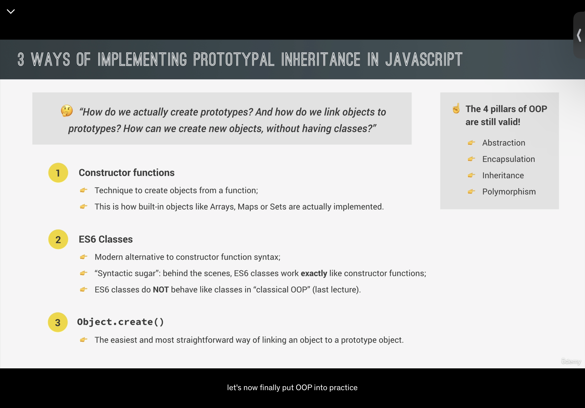
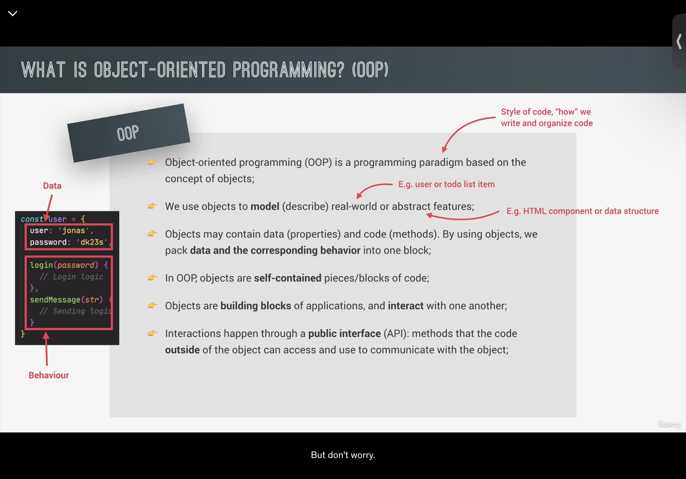
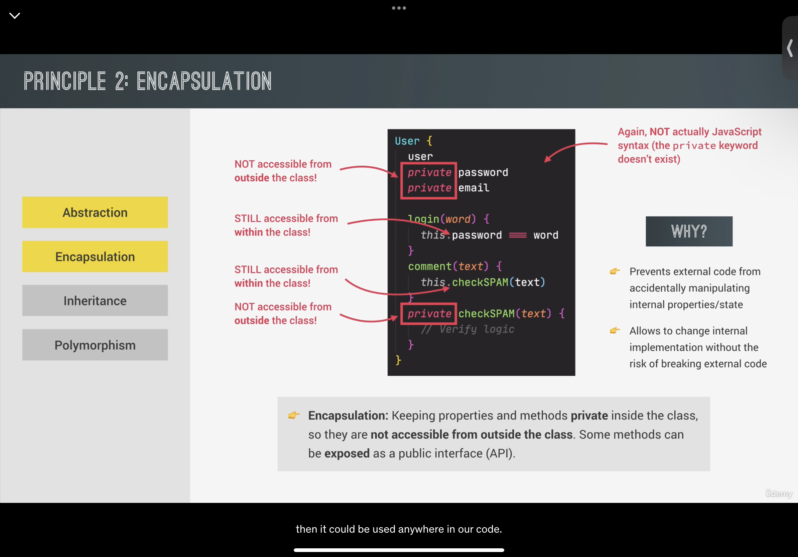
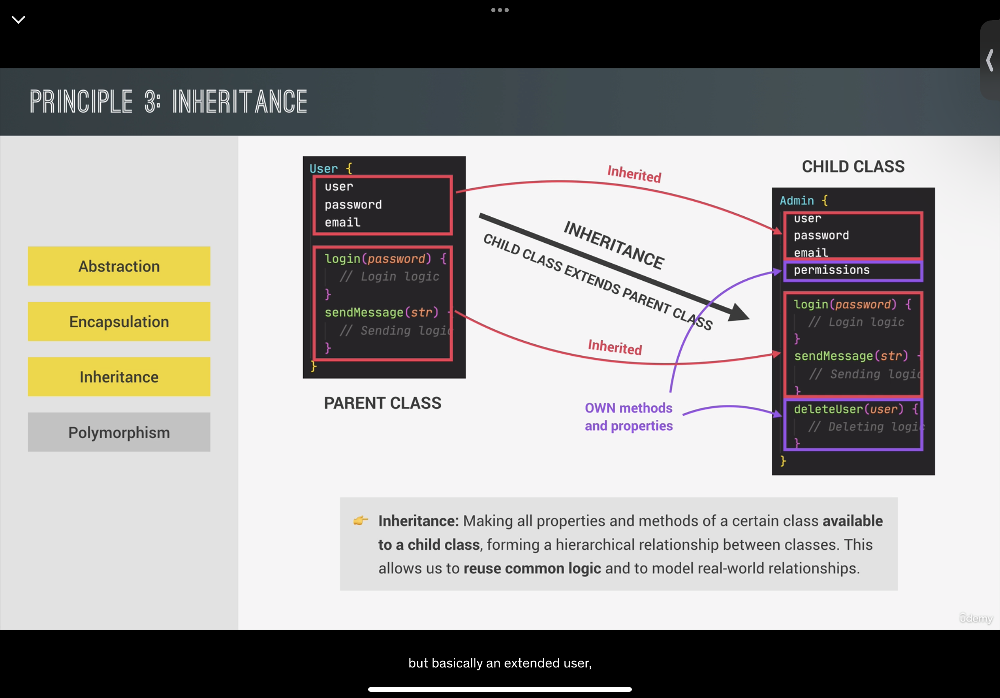
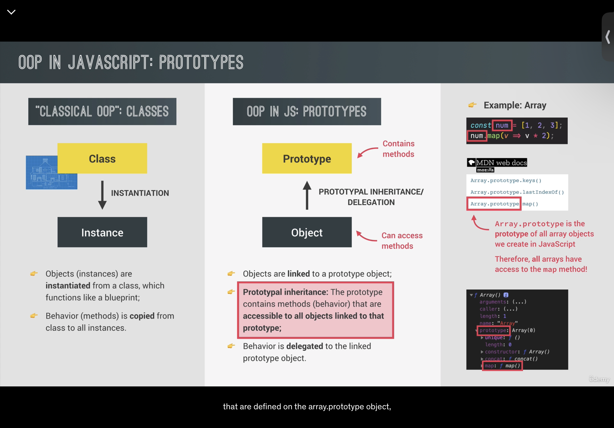

下面是对您提供的 JavaScript 文件中各节课内容的详细解释，包括知识点和示例代码：

### 1. 构造函数和 `new` 操作符【16†source】
- **知识点**：
  - 构造函数用于创建对象。
  - 使用 `new` 操作符创建新对象，该过程包括创建一个空对象、绑定 `this`、链接到原型、自动返回对象。
- **示例代码**：
  ```javascript
  const Person = function (firstName, birthYear) {
    this.firstName = firstName;
    this.birthYear = birthYear;
  };
  const jonas = new Person('Jonas', 1991);
  ```

### 2. 类（ES6）【17†source】
- **知识点**：
  - 类提供了一种更清晰的方式来创建对象和实现继承。
  - 类不会提升（hoisted），是一等公民（first-class citizens），总是在严格模式下执行。
- **示例代码**：
  ```javascript
  class PersonCl {
    constructor(fullName, birthYear) {
      this.fullName = fullName;
      this.birthYear = birthYear;
    }
    calcAge() {
      console.log(2037 - this.birthYear);
    }
  }
  ```

### 3. 继承：`Object.create`【18†source】
- **知识点**：
  - 使用 `Object.create` 创建一个新对象，继承自另一个对象的原型。
  - 可以创建原型之间的链。
- **示例代码**：
  ```javascript
  const PersonProto = {
    calcAge() {
      console.log(2037 - this.birthYear);
    }
  };
  const steven = Object.create(PersonProto);
  ```

### 4. 封装：私有字段和方法【19†source】
- **知识点**：
  - 在类中可以有公共和私有字段（fields）和方法。
  - 私有字段和方法通常以 `#` 开头，仅在类内部可访问。
- **示例代码**：
  ```javascript
  class Account {
    #movements = [];
    #pin;
    constructor(owner, currency, pin) {
      this.owner = owner;
      this.currency = currency;
      this.#pin = pin;
    }
  }
  ```

### 5. 使用 `Object.create`【20†source】
- **知识点**：
  - `Object.create` 除了用于继承，也可以用来直接创建新对象。
  - 这种方式允许更直接地控制对象的原型。
- **示例代码**：
  ```javascript
  const PersonProto = {
    calcAge() {
      console.log(2037 - this.birthYear);
    }
  };
  const sarah = Object.create(PersonProto);
  ```

### 6. 继承：构造函数【21†source】
- **知识点**：
  - 通过构造函数实现继承。
  - 使用 `Object.create` 将一个构造函数的原型链接到另一个构造函数的原型。
- **示例代码**：
  ```javascript
  const Student = function (firstName, birthYear, course) {
    Person.call(this, firstName, birthYear);
    this.course = course;
  };
  Student.prototype = Object.create(Person.prototype);
  ```

### 7. 原型链【22†source】
- **知识点**：
  - 所有 JavaScript 对象都有一个原型，对象从原型继承属性和方法。
  - 原型本身也是对象，因此它也有自己的原型，形成所谓的原型链。
- **示例代码**：
  ```javascript
  console.log(jonas.__proto__);
  Person.prototype.species = 'Homo Sapiens';
  ```

### 8. ES6 类：详解【23†source】
- **知识点**：
  - ES6 类的基本构成，包括构造器、实例方法、静态方法、getter和setter。
- **示例代码**：
  ```javascript
  class PersonCl {
    constructor(fullName, birthYear) {
      this.fullName = fullName;
      this.birthYear = birthYear

;
    }
    calcAge() {
      console.log(2037 - this.birthYear);
    }
  }
  ```

### 9. 继承：ES6 类【24†source】
- **知识点**：
  - ES6 类可以通过 `extends` 和 `super` 关键字实现继承。
- **示例代码**：
  ```javascript
  class PersonCl {
    constructor(fullName, birthYear) {
      this.fullName = fullName;
      this.birthYear = birthYear;
    }
  }
  ```

### 10. ES6 类：私有字段【25†source】
- **知识点**：
  - ES6 类中可以定义私有字段，这些字段在类外部无法访问。
- **示例代码**：
  ```javascript
  class EVCl extends CarCl {
    #charge;
    constructor(make, speed, charge) {
      super(make, speed);
      this.#charge = charge;
    }
  }
  ```

### 11. 构造函数：实践【26†source】
- **知识点**：
  - 使用构造函数和原型方法创建和操作对象。
- **示例代码**：
  ```javascript
  const Car = function (make, speed) {
    this.make = make;
    this.speed = speed;
  };
  Car.prototype.accelerate = function () {
    this.speed += 10;
  };
  ```

### 12. 类：Getter和Setter【27†source】
- **知识点**：
  - 类中可以使用 getter 和 setter 方法来控制对特定属性的访问和修改。
- **示例代码**：
  ```javascript
  class CarCl {
    constructor(make, speed) {
      this.make = make;
      this.speed = speed;
    }
    get speedUS() {
      return this.speed / 1.6;
    }
    set speedUS(speed) {
      this.speed = speed * 1.6;
    }
  }
  ```

### 13. 链式调用【28†source】
- **知识点**：
  - 在类的方法中返回 `this` 可以实现链式调用。
- **示例代码**：
  ```javascript
  class CarCl {
    accelerate() {
      this.speed += 10;
      return this;
    }
    brake() {
      this.speed -= 5;
      return this;
    }
  }
  ```

### 14. 构造函数：多次调用【29†source】
- **知识点**：
  - 通过构造函数创建的对象可以多次调用其原型上的方法。
- **示例代码**：
  ```javascript
  const Car = function (make, speed) {
    this.make = make;
    this.speed = speed;
  };
  Car.prototype.accelerate = function () {
    this.speed += 10;
  };
  Car.prototype.brake = function () {
    this.speed -= 5;
  };
  ```

这些知识点和示例代码涵盖了面向对象编程的关键概念，包括构造函数、原型链、类、继承和封装等，是理解和使用 JavaScript 对象和类的基础。