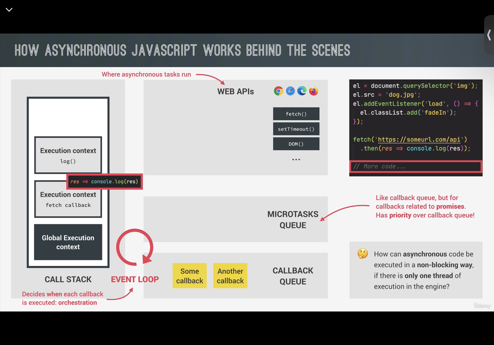
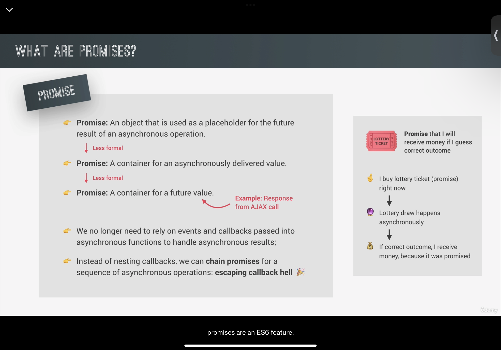

# Promise

### Promise的状态和微任务（microtasks）

1. **Promise状态**：在调用`resolve`之前，Promise处于`Pending`（待定）状态。这期间，Promise本身并不在微任务队列（microtasks queue）中，而是在等待某个操作（通常是异步的）来解析它。

2. **微任务队列**：微任务队列是一个特殊的队列，用于存放那些需要在当前执行栈（call stack）清空后、但在下一次事件循环（event loop）之前执行的任务。Promise相关的回调（例如`then`、`catch`、`finally`）在Promise被解析（通过`resolve`或`reject`）时，被加入到微任务队列。

### 工作流程

1. **Promise创建和执行**：当一个Promise被创建并执行时（例如进行某个异步操作），它开始时处于 `Pending` 状态。此时，与Promise相关的代码继续执行，但`then`、`catch`、`finally`中的回调不会立即执行。

2. **调用resolve/reject**：一旦异步操作完成（成功或失败），`resolve`或`reject`会被调用。这会将Promise的状态改变为`Fulfilled`或`Rejected`。

3. **微任务加入队列**：调用`resolve`或`reject`后，相应的`then`、`catch`、`finally`中的回调函数会被添加到微任务队列。

4. **执行微任务**：当前的执行栈（call stack）清空后，事件循环（event loop）会检查微任务队列。如果队列中有任务，它们将被依次取出并执行，直到微任务队列为空。

5. **进入下一轮事件循环**：微任务队列清空后，事件循环继续，进行如宏任务（例如setTimeout、setInterval、I/O）的处理。

### 示例

假设有以下代码：

```javascript
let promise = new Promise((resolve, reject) => {
    // 假设这里有一些异步操作
    setTimeout(() => {
        resolve("操作成功");
    }, 1000);
});

promise.then(result => {
    console.log(result);
});

console.log("代码执行结束");
```

在这个例子中的执行顺序是：
1. Promise被创建并执行，开始处于`Pending`状态。
2. `console.log("代码执行结束")`执行。
3. 约1秒后，setTimeout的回调执行，调用`resolve`。
4. `then`的回调加入微任务队列。
5. 当前执行栈清空后，事件循环检查微任务队列，执行`then`的回调。

在这个流程中，`then`的回调是作为微任务被处理的，确保在当前执行栈完成后、新的事件循环开始前执行。这就是为什么我们通常看到Promise的回调似乎总是在同步代码执行完毕后才运行。

