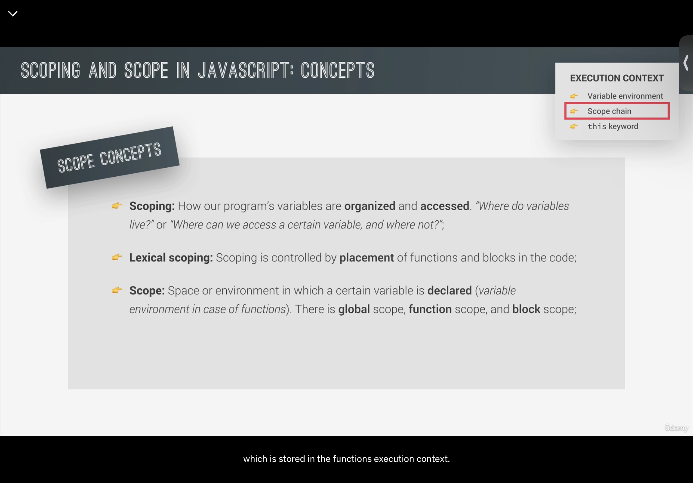

# JavaScript Notes

[TOC]

## JavaScript 语言的特性

### High-level

### Garbage-collected

### Interpreted or just-in-time compiled

### Multi-paradigm

### Prototype-based object-oriented

### First-class functions

In a language with **first-class functions, ** functions are simply **treated as variables**. We can pss them into other functions, and return them from functions

"First-class functions" 是一个编程语言特性，指的是编程语言将函数视为一等公民（First-class citizens）或一等对象（First-class objects），并赋予它们与其他数据类型相同的权利和地位。在具有这种特性的编程语言中，函数可以像其他数据类型一样自由地传递、分配给变量、作为参数传递给其他函数，并从其他函数返回。

具体来说，编程语言支持 first-class functions 特性时，通常具备以下几个方面的能力：

1. **函数可以赋值给变量**：你可以将函数分配给变量，并随时引用和调用这个函数。这允许你创建匿名函数（函数字面量）并将其赋值给变量。

2. **函数可以作为参数传递**：你可以将函数作为参数传递给其他函数，从而实现高阶函数（Higher-Order Functions）的概念。高阶函数接受一个或多个函数作为参数，并/或返回一个函数。

3. **函数可以从其他函数返回**：你可以从一个函数中返回另一个函数。这使得你可以创建闭包（closures）和工厂函数（factory functions），这些函数可以捕获其外部作用域中的变量。

4. **函数可以存储在数据结构中**：你可以将函数存储在数组、对象、映射等数据结构中，并像操作其他数据一样操作这些函数。

编程语言中具有 first-class functions 特性的例子包括 JavaScript、Python、Ruby、Scala、Haskell 等。这种特性允许编写更加灵活和模块化的代码，以及使用函数式编程范式的优势，如高阶函数、函数组合和延迟执行等。

### Dynamic-type

No data type definitions. Types becomes known at runtime. Data type of variable is changed automatically.

### Single-threaded

- Concurrency model: how the JavaScript engine handles multiple tasks happening at the same time.
- JavaScript runs in one single thread, so it can only do one thing at a time.
- By using the event loop: takes long running tasks, executes them in the “background”, and puts them back in the main thread once they are finished.

### Non-blocking event loop

## What is a JavaScript Engine

Definition: Program that executes JavaScript code. (V8 Google Chrome, Node.js).


### Complication VS. Interpretation

Complication : Entire code is converted into machine code at once, and written to a binary file that can be executed by a computer.

Interpreter runs through the source code and executes it line by line.

Just-in-time (JIT) complication: Entire cdoe is converted into machine code at once, then executed immediately. 


### JavaScript Runtime

Callback functions are put in the callback queue.


They are put in the call stack, where are they are executed, until the call stack becomes empty.

This is the event loop.


For `Node.js`, there is no WEB APIs.

## What is an execution context

在JavaScript中，执行上下文（Execution Context）是一个抽象的概念，用于描述在代码运行时JavaScript引擎如何追踪函数的调用，变量的值等。每当JavaScript代码执行时，都会在执行栈上创建执行上下文。一个执行上下文可以被视为当前代码执行的环境，它决定了this的值，变量，对象以及函数如何互相交互。

执行上下文主要包括三个部分：

1. **全局执行上下文（Global Execution Context）**：
   - 这是代码运行时的默认环境，在浏览器中，全局执行上下文创建了一个全局对象`window`，而在Node.js中则是`global`。
   - 代码中所有不在函数内部的变量和函数都是在全局执行上下文中声明的。
   - 在一个程序中只有一个全局执行上下文。

2. **函数执行上下文（Function Execution Context）**：
   - 每当一个函数被调用时，就会为那个函数创建一个新的执行上下文。
   - 这个执行上下文包括函数的局部变量，参数，以及为该函数调用创建的`this`。
   - 在函数执行完毕后，其执行上下文会被弹出执行栈并等待垃圾回收。

3. **评估执行上下文（Eval Execution Context）**：
   - 当使用`eval`函数时，会为其创建一个特殊的执行上下文。
   - 由于安全和性能原因，`eval`的使用并不推荐。

每个执行上下文包含以下组成部分：

- **变量对象（Variable Object，VO）/活动对象（Activation Object，AO）**：包含了函数的参数、局部变量、函数声明等。
- **作用域链（Scope Chain）**：决定了当前上下文中的代码对其他上下文中的变量和函数的访问权限。
- **this指针**：在全局执行上下文中，`this`指向全局对象；在函数执行上下文中，`this`的值取决于函数是如何被调用的。

执行上下文的生命周期可以分为两个阶段：

1. **创建阶段**：
   
   - 当函数被调用，但未执行任何其内部代码之前，会创建执行上下文。
   - 在这个阶段，函数的参数会被初始化，函数声明会被提升并分配到内存中，`this`值会被确定。
   
2. **执行阶段**：
   
   - 在这个阶段，代码实际上被执行。
   
   - 变量赋值，函数引用，以及执行代码的其他行为都会发生。此时，活动对象（AO）会包含所有变量对象（VO）的属性，加上函数调用时传递的参数和函数内通过变量声明创建的局部变量。
   
     在执行阶段，JavaScript 引擎会按照代码编写的顺序逐行执行。如果遇到函数调用，一个新的函数执行上下文会被创建并推入执行栈顶部。这个新的上下文会经历相同的两个阶段—创建和执行。在函数执行完毕后，返回其结果（如果有的话），然后该函数的执行上下文会被移出执行栈，控制权回到创建它的上下文中。
   
     此外，JavaScript 引擎使用执行栈来处理执行上下文的创建和销毁。执行栈，也被称为调用栈，遵循后进先出（LIFO）原则，确保函数调用的顺序和返回的顺序一致。
   
     在执行栈中，全局执行上下文是最先被放入的，并且只会在程序结束时被移除。每当一个新的函数被调用，一个新的执行上下文就会被创建并推入栈顶。每当一个函数执行结束，其对应的执行上下文就会被弹出栈。
   
     作用域链在执行上下文中扮演着重要角色。它由当前上下文的变量对象以及所有父执行上下文的变量对象组成，这为变量的查找提供了一个层级结构。当代码试图访问一个变量时，JavaScript 引擎会首先在当前的执行上下文中查找。如果没有找到，引擎会沿着作用域链向上查找，直到找到该变量或到达全局执行上下文。如果在全局上下文中仍未找到，通常会抛出一个引用错误。
   
     理解执行上下文和作用域链对于深入理解闭包、变量提升、以及JavaScript中的高级函数概念至关重要。这些概念是 JavaScript 中高效编码和性能优化的基石。

在 JavaScript 中，"Variable Environment" 是一个与执行上下文（Execution Context）密切相关的概念。每个执行上下文都有三个重要的组成部分：Variable Environment、Lexical Environment 和 This Binding。这些组成部分共同决定了代码在运行时变量如何被查找、访问和修改。

### Variable Environment

- **定义**：Variable Environment 是一个抽象概念，它表示与执行上下文相关的环境，其中存储了变量的绑定（即变量名与其对应值的映射关系）。
- **功能**：它主要用于存储变量声明（特别是用 `var` 声明的变量）和函数声明。在 ES6 之前，JavaScript 中只有 Variable Environment，没有 Lexical Environment 的概念。

### Lexical Environment

- **引入**：在 ES6 中，引入了 Lexical Environment 的概念，它类似于 Variable Environment，但有一些关键的差异。
- **区别**：Lexical Environment 不仅包括变量的绑定，还考虑了代码的词法嵌套结构。这意味着它可以根据代码编写时的位置来确定变量的作用域。Lexical Environment 用于存储用 `let` 和 `const` 声明的变量。

### 重要性

- **作用域链**：Lexical Environment 和 Variable Environment 共同构成了 JavaScript 的作用域链。当查找一个变量时，JavaScript 引擎会先在当前执行上下文的 Lexical Environment 中查找，如果没有找到，它会沿着作用域链向上查找，直到全局执行上下文的 Lexical Environment。
- **闭包**：这些环境也是理解闭包（Closures）的关键。闭包是函数和其周围状态（即 Lexical Environment）的组合。

在 JavaScript 中，函数声明（Function Declarations）通常是在 Variable Environment 中进行处理的。这是因为传统上，Function Declarations 是按照一个稍微不同的规则来提升的（hoisted），相比于用 `let` 和 `const` 声明的变量（这些是在 Lexical Environment 中处理的）。

### Function Declaration 提升（Hoisting）

- 当 JavaScript 代码执行前，它首先经过一个编译阶段，在这个阶段，函数声明会被提升到它们各自作用域的顶部。
- 这意味着即使函数声明在代码中出现在后面，它们在实际执行之前就已经可用了。

### Variable Environment 与 Function Declarations

- 在 ES6 引入 `let` 和 `const` 之前，JavaScript 中只有 Variable Environment，没有 Lexical Environment 的概念。
- 传统上，Variable Environment 负责存储使用 `var` 声明的变量和函数声明。
- 尽管 ES6 之后的 JavaScript 引入了 Lexical Environment 来处理用 `let` 和 `const` 声明的变量，函数声明仍然被视为是在 Variable Environment 中。

### 实际情况

- 在实际执行时，JavaScript 引擎可能会对这些环境进行优化和整合，所以从技术实现的角度看，这两个环境可能并不是完全分离的。
- 重要的是要理解函数声明与变量声明的区别，尤其是它们的提升（hoisting）行为。

### Scope



Scope of variable: Region of our code where a certain variable can be accessed.


### 函数作用域（Function Scope）
- 函数作用域是指在函数内声明的变量只能在函数内部被访问。
- 函数内部定义的变量在函数外部是不可见的。
- `var` 关键字在 ES6 之前是 JavaScript 定义变量的主要方式，它遵循函数作用域。
- 函数作用域支持变量提升，意味着在函数内部，无论变量在哪里声明，都会被提升到函数的顶部。

```javascript
function myFunction() {
    var functionScoped = "I am only accessible within this function";
    // functionScoped 可以在这里访问
}
// functionScoped 在这里不可访问
```

### 块作用域（Block Scope）
- 块作用域是指在一对花括号 `{}` 内声明的变量只能在这对花括号的内部被访问，这对花括号通常是由控制流语句（如 `if` 或 `for` 循环）创建的。
- ES6 引入了 `let` 和 `const` 关键字，允许变量和常量具有块作用域。
- 在块作用域中，变量不会被提升，这意味着你必须在声明变量后才能使用它们。

```javascript
if (true) {
    let blockScoped = "I am only accessible within this block";
    const alsoBlockScoped = "Me too!";
    // blockScoped 和 alsoBlockScoped 在这里可以访问
}
// blockScoped 和 alsoBlockScoped 在这里不可访问
```

这两种作用域的区别在于它们的可见性和生命周期。函数作用域的变量在整个函数内部都是可见的，包括在嵌套的块中。而块作用域的变量只在声明它们的块和嵌套在该块内的任何子块中可见。

块作用域的引入使得 JavaScript 的控制流语句（如 `if` 和 `for`）的行为与其他使用块作用域的编程语言（如 C 或 Java）更加一致，并允许开发者编写更易于管理和预测的代码，特别是在处理复杂的嵌套控制流时。

### Scope Chain


### Variable Environment: Hoisting and The TDZ


Function expressions and arrows cannot be used before we declare them.

Function delaratoins can be used before we declare them.

## `this` Keyword


## Arrow function vs. function

### `this`

```javascript
const jonas = {
  year: 1991,
  firstName: "Jonas",
  calcAge() {
    console.log(this); // jonus
    console.log(2037 - this.year); // 46
    // Solution 1
    // const self = this;
    // function isMillenial() {
    //   console.log(self);
    //   console.log(self.year >= 1981 && self.year <= 1996);
    // }
    // isMillenial();

    // Solution 2
    const isMillenial = () => {
      console.log(this); // jonus
      console.log(this.year >= 1981 && this.year <= 1996); // true
    };
    isMillenial();
  },
};
jonas.calcAge();
```

1. `calcAge` 被作为 `jonas` 对象的方法调用，因此在 `calcAge` 函数中的 `this` 指向 `jonas`。

2. 在 `calcAge` 方法内部，定义了一个箭头函数 `isMillenial`。

3. 当 `isMillenial` 被调用时，它不会创建自己的 `this` 绑定。相反，它捕获（继承）其外围作用域（即 `calcAge` 方法）中的 `this` 值，该值指向 `jonas` 对象。

4. 因此，当 `isMillenial` 中的 `console.log(this)` 执行时，它输出 `jonas` 对象，因为这是从 `calcAge` 方法继承的 `this` 的值。

5. 同理，当 `console.log(this.year >= 1981 && this.year <= 1996)` 在 `isMillenial` 中执行时，它使用 `jonas` 对象的 `year` 属性进行计算。

```javascript
var firstName = "Matilda";

const jonas = {
  year: 1991,
  firstName: "Jonas",
  calcAge() {
    console.log(this);
    console.log(2037 - this.year);
  },
  great: () => {
    console.log(`Hey ${this.firstName}`);
  },
};

jonas.great(); // Output: Hey Matilda
```

因为箭头函数自身没有this, 他会继承上一级的this, 上一级this是window, 因为 `window.firstName = "Matilda"`, 又因为`firstName`使用`var`声明的, `var`会在`window`中添加`firstName`属性, 所以会输出 `Hey Matilda`. 但是如果是使用`const`和`let`, 那么就是`undefined`, 因为 `let` 和 `const` 声明的变量不会成为全局对象（在浏览器中是 `window`）的属性。

### `argument`

箭头函数没有argument keyword

```javascript
const addExpr = function (a, b) {
  console.log(arguments);
  return a + b;
};
addExpr(2, 5); // 返回两个
addExpr(2, 5, 8, 12); // 会返回四个

// Arrow function does not have argument keyword
var addArrow = (a, b) => {
  console.log(arguments);
  return a + b;
};
addArrow(2, 5, 8); //Error
```

## Primitives vs. Objects (Reference Types)

Primitives are stored in call stack.

Reference types are stored in heap.


对于Objects, 在 call stack中存放的是对应HEAP地址的reference.

```javascript
let lastName = "Williams";
let oldLastName = lastName;
lastName = "Davis";
console.log(lastName, oldLastName); // Davis, Williams

const jessica = {
  firstName: "Jessica",
  lastName: "Williams",
  age: 27,
};

const marriedJessica = jessica;
marriedJessica.lastName = "Davis";
console.log("Before marriage", jessica); // Davis
console.log("After marriage", marriedJessica); // Davis
```

```javascript
// Copy objects
const jessica2 = {
  firstName: "Jessica",
  lastName: "Williams",
  age: 27,
  family: ["Alice", "Bob"],
};

const jessicaCopy = Object.assign({}, jessica2);
jessicaCopy.lastName = "Davis";
console.log("Before marriage", jessica2);	// Williams
console.log("After marriage", jessicaCopy);	// Davis

jessicaCopy.family.push("Mary");
jessicaCopy.family.push("John");
console.log("Before marriage", jessica2); // ["Alice", "Bob", "Mary", "John"]
console.log("After marriage", jessicaCopy); // ["Alice", "Bob", "Mary", "John"]
```

依然是浅拷贝, `assign`依然只是拷贝了`family`的reference. 所以`jessicaCopy`的改变也会作用于`jessica2`.

## callback functions

在 JavaScript 中，函数即对象。所以，我们可以将函数作为参数传递给其他函数，在外部函数中调用它。

```javascript
function print(callback) {  
    callback();
}
```

print( ) 函数将另一个函数作为参数，并在函数体内部调用它。在 JavaScript 里，我们叫它“回调”。所以，被传递给另一个函数作为参数的函数叫作回调函数。

### 为什么需要回调函数？

JavaScript 按从上到下的顺序运行代码。但是，在有些情况下，必须在某些情况发生之后，代码才能运行（或者说必须运行），这就不是按顺序运行了。这是异步编程。

回调函数确保：函数在某个任务完成之前不运行，在任务完成之后立即运行。它帮助我们编写异步 JavaScript 代码，避免问题和错误。

在 JavaScript 里创建回调函数的方法是将它作为参数传递给另一个函数，然后当某个任务完成之后，立即调用它。

### 如何创建回调函数

```javascript
const message = function() {  
    console.log("This message is shown after 3 seconds");
}
 
setTimeout(message, 3000);
```

JavaScript 有一个内建方法叫作 `setTimeout`，它会在给定的时间段（以毫秒为单位）后调用函数或计算表达式。因此，在这里，经过 3 秒后将调用 message 函数（1 秒 = 1000 毫秒） 。

换句话说，message 函数是在发生某事之后（在本示例中为 3 秒之后），而不是在此之前被调用。因此，message 函数就是一个回调函数。

### 用箭头函数写回调函数

```javascript
setTimeout(() => { 
    console.log("This message is shown after 3 seconds");
}, 3000);
```


## `this` keyword

The `this` keyword in JavaScript can be a bit tricky, especially for those coming from other programming languages. In JavaScript, `this` refers to an object that's set at the creation of a new execution context (function invocation). The value it gets can be quite different based on the context in which a function is called. Let's delve into it:

### Global Context

In the global execution context (outside of any function), `this` refers to the global object. In a browser, the global object is `window`.

```javascript
console.log(this === window); // true
```

In Node.js, it refers to the global object, which is `global`.

### Function Context

Within a function, the value of `this` depends on how the function is called.

1. **Regular function call**:

   ```javascript
   function exampleFunction() {
     console.log(this);
   }

   exampleFunction(); // logs: global object (`window` in browsers, `global` in Node.js)
   ```

2. **Object method**:

   When a function is called as a method of an object, `this` is set to the object the method is called on.

   ```javascript
   const obj = {
     method: function() {
       console.log(this);
     }
   };

   obj.method(); // logs: obj
   ```

3. **Constructor function**:

   When a function is used as a constructor (with the `new` keyword), `this` is set to a brand new object.

   ```javascript
   function Car(make, model) {
     this.make = make;
     this.model = model;
   }

   const myCar = new Car('Toyota', 'Corolla');
   console.log(myCar); // logs: Car { make: 'Toyota', model: 'Corolla' }
   ```

4. **Event handlers**:

   In most cases, when a function is used as an event handler in the DOM, `this` refers to the DOM element that the event was bound to.

   ```javascript
   button.addEventListener('click', function() {
     console.log(this);  // logs: <button> element
   });
   ```

5. **Using call, apply, and bind**:

   These are methods that all functions have, allowing you to manually set the value of `this`.

   - `call`: Calls a function with a given `this` value and arguments.
   - `apply`: Like `call`, but takes an array-like list of arguments.
   - `bind`: Returns a new function with a bound `this` value (and optionally bound arguments).

   ```javascript
   function greet() {
     console.log(`Hello, ${this.name}`);
   }
   
   const user = { name: 'Alice' };
   greet.call(user);  // logs: "Hello, Alice"
   ```

### Arrow Functions

Arrow functions do not have their own `this`. Instead, they capture the `this` value of the enclosing context.

```javascript
const obj = {
  name: 'Bob',
  getGreeting: function() {
    return () => {
      console.log(`Hi, my name is ${this.name}`);
    };
  }
};

const greet = obj.getGreeting();
greet(); // logs: "Hi, my name is Bob"
```

### Strict Mode

In strict mode (`'use strict';`), the value of `this` remains at whatever it's set to when entering the execution context. If it's not defined, it remains `undefined`.

```javascript
'use strict';
function demoFunction() {
  console.log(this);
}

demoFunction(); // logs: undefined
```

### Summary

1. `this` in the global context points to the global object (`window` in browsers, `global` in Node.js).
2. Inside a function, `this` depends on how the function is called (regularly, as a method, as a constructor, or with `call/apply/bind`).
3. Arrow functions don't bind their own `this`, they inherit it from the enclosing scope.
4. In strict mode, if `this` is not defined, it remains `undefined`.

It's a good practice to be aware of the context in which your function will be called to avoid unexpected behavior with the `this` keyword. If necessary, you can always ensure a specific `this` using function methods like `bind`.

当然，这是关于JavaScript中函数调用（带括号）与函数引用（不带括号）的详细说明，方便您做笔记：

## JavaScript中函数带括号与不带括号的区别

### 带括号（函数调用）

1. **定义**：在函数名后直接加上一对括号（如 `myFunction()`）。
   
2. **行为**：表示立即执行或调用该函数。
   
3. **返回值**：调用函数将返回函数执行的结果。如果函数没有返回值（即返回`undefined`），则得到的是`undefined`。

4. **使用场景**：
   - 当需要获取函数执行的结果时。
   - 在需要立即执行函数的情景下，如赋值操作（`let result = myFunction();`），或直接在逻辑流程中调用。

5. **示例**：
   ```javascript
   function add(a, b) {
     return a + b;
   }
   let sum = add(5, 3); // 调用函数并获取返回值
   ```

### 不带括号（函数引用）

1. **定义**：仅使用函数名，后面不加括号（如 `myFunction`）。

2. **行为**：这表示对函数对象本身的引用，而非执行它。

3. **使用场景**：
   - 将函数作为参数传递给其他函数，如回调函数。
   - 将函数赋值给变量。
   - 在对象或类中作为属性或方法引用。

4. **示例**：
   ```javascript
   function greet() {
     console.log("Hello!");
   }
   let sayHello = greet; // 函数引用，不执行函数
   setTimeout(greet, 1000); // 作为回调函数传递，1秒后执行
   ```

### 关键点总结

- **带括号**表示立即执行函数并处理其返回值。
- **不带括号**表示引用函数对象，可以稍后调用或传递给其他函数。
- 理解这两者的区别对于编写正确和高效的JavaScript代码至关重要。

## JavaScript Arrow Function

Arrow functions are a feature introduced in ECMAScript 6 (also known as ES6 and ES2015) to provide a more concise syntax for writing function expressions in JavaScript. Here's a quick overview of arrow functions and their differences from traditional function expressions.

### Syntax of Arrow Functions

The basic syntax for an arrow function is:

```javascript
const functionName = (parameter1, parameter2, ...rest) => {
  // function body
};
```

For single-parameter functions, the parentheses around the parameter can be omitted:

```javascript
const square = x => x * x;
```

For single-expression functions, the curly braces and the `return` keyword can be omitted, and the value of the expression will be implicitly returned:

```javascript
const add = (a, b) => a + b;
```

### Differences Between Arrow Functions and Normal Functions

1. **Syntax**: As shown above, arrow functions have a more concise syntax than traditional function expressions.

2. **`this` Behavior**: The value of `this` inside an arrow function is determined by the surrounding lexical context. In other words, arrow functions do not have their own `this` value. This contrasts with regular functions, which determine `this` based on how they're called.

   ```javascript
   function Timer() {
     this.seconds = 0;
     setInterval(() => {
       this.seconds++;  // 'this' correctly refers to Timer instance
     }, 1000);
   }
   ```

   With a regular function, `this` inside the `setInterval` callback would point to the global object (or be `undefined` in strict mode) rather than the `Timer` instance.

   

   箭头函数不会创建自己的`this，它只会从自己的作用域链的上一层继承 this`。因此，在下面的代码中，传递给`setInterval`的函数内的`this`与封闭函数中的`this`值相同

   ```javascript
   function Person() {
     this.age = 0;
   
     setInterval(() => {
       this.age++; // |this| 正确地指向 p 实例
     }, 1000);
   }
   
   let p = new Person();
   
   ```

   

3. **Arguments Object**: Arrow functions do not have their own `arguments` object. If you try to access the `arguments` object within an arrow function, it will access the `arguments` object from the enclosing scope.

4. **Constructor**: Arrow functions cannot be used as constructors. That is, you cannot use the `new` keyword with them. They don't have the `prototype` property.

5. **Method Overhead**: While arrow functions can be used as object methods, they're not suitable when you need to access the object's properties using `this`. Since they capture the `this` value from the enclosing context, it won't point to the object.

   ```javascript
   const obj = {
     value: 'Hello',
     method: () => {
       console.log(this.value); // undefined
     }
   };
   ```

6. **No Named Function**: Arrow functions cannot have named expressions, while traditional functions can.

7. **Yielding**: Arrow functions cannot be used as generators and therefore cannot make use of the `yield` keyword.

### When to Use Arrow Functions

Arrow functions are great for:

- Short callbacks or event handlers.
- Functions where you want to capture the `this` context from the surrounding code.
- Pure functions without side effects (like in functional programming patterns).

However, you might want to stick with regular function expressions or declarations when:

- You need a function with its own `this` binding (e.g., object methods or constructors).
- You need a named function expression for debugging or recursion.
- You want to use the function as a generator with the `yield` keyword.

In conclusion, arrow functions offer a concise syntax and have some unique characteristics, especially concerning the `this` keyword. By understanding these characteristics, you can decide when and where to use them effectively.

## Spread/Rest Operator

In JavaScript, the "..." symbol is called the "spread" operator or "rest" operator, depending on how it is used. Let's look at both of its uses:

### Spread Operator

When used as the spread operator, "..." is used to expand or "spread" iterable elements (like arrays) into individual elements or to expand object properties.

#### Example in Arrays:

```javascript
const array1 = [1, 2, 3];
const array2 = [4, 5, 6];

// Combines array1 and array2 into a new array
const combinedArray = [...array1, ...array2];
console.log(combinedArray); // Output: [1, 2, 3, 4, 5, 6]
```

#### Example in Objects:

```javascript
const obj1 = { foo: 'bar', x: 42 };
const obj2 = { foo: 'baz', y: 13 };

// Merge obj1 and obj2. Note that the second "foo" property overwrites the first.
const mergedObj = { ...obj1, ...obj2 };
console.log(mergedObj); // Output: { foo: 'baz', x: 42, y: 13 }

const obj3 = {...obj1, foo: 'lhzdnb'} // {foo: 'lhzdnb', x: 42}
```

#### Example in Function Arguments:

```javascript
function sum(x, y, z) {
  return x + y + z;
}

const numbers = [1, 2, 3];

// Passes elements of numbers as arguments to the function
console.log(sum(...numbers)); // Output: 6
```

### Rest Operator

When used as the rest operator, "..." is used to represent an indefinite number of arguments as an array.

#### Example:

```javascript
function myFunction(...args) {
  console.log(args); // args is an array of all passed arguments
}

myFunction(1, 2, 3, 4); // Output: [1, 2, 3, 4]
```

Here, `...args` gathers all the arguments passed to the function into a single array named `args`.

It's important to note that the rest operator is only used in the function's parameter list.

### Distinguishing Spread and Rest

The key difference between spread and rest lies in where they are used:

- **Spread** is used when **all elements from an object or array need to be included in a list** of some kind (like function arguments, array elements, or object properties).
- **Rest** is used when we want to **capture a list of arguments into an array** within a function's parameters.

Both features were introduced in ES6 (ECMAScript 2015) and have since become very common in JavaScript for their convenience and utility.

In JavaScript, prototypes are a fundamental concept that underpin the language's prototype-based inheritance mechanism. Unlike classical inheritance used in languages like Java or C++, JavaScript does not use classes (until ES6 introduced `class` as syntactic sugar over existing prototype-based inheritance) but rather prototypes to share properties and methods across objects.

## Prototypes

### The Prototype Chain

Every JavaScript object has a property called `prototype` (accessible via `Object.getPrototypeOf(obj)` or `__proto__` which is deprecated). This is a reference to another object from which the original object inherits properties and methods. When you attempt to access a property or method of an object, JavaScript will first search on the object itself, and if it does not find it, JavaScript will look up the object's prototype chain until it either finds the named property/method or reaches the end of the chain (which will be `null`).

### Prototypes in Action

```javascript
// Constructor function
function Person(name) {
  this.name = name;
}

// Adding a method to the prototype
Person.prototype.sayHello = function() {
  return "Hello, I'm " + this.name;
};

// Creating an object using the Person constructor
var person1 = new Person('Alice');
var person2 = new Person('Bob');

// Both person1 and person2 inherit the sayHello method from their prototype
console.log(person1.sayHello()); // "Hello, I'm Alice"
console.log(person2.sayHello()); // "Hello, I'm Bob"
```

### Prototypal Inheritance

Inheritance in JavaScript is prototypal. That means that objects can inherit properties and methods from other objects. Here is an example:

```javascript
// Constructor for Person
function Person(firstName, lastName) {
  this.firstName = firstName;
  this.lastName = lastName;
}

// A method added to the prototype of Person
Person.prototype.fullName = function() {
  return this.firstName + ' ' + this.lastName;
};

// Constructor for Student
function Student(firstName, lastName, subject) {
  // Call the parent constructor, making sure (using Function#call) that "this" is
  // set correctly during the call
  Person.call(this, firstName, lastName);

  this.subject = subject;
}

// Student.prototype needs to inherit from Person.prototype
Student.prototype = Object.create(Person.prototype);

// Set the "constructor" property to refer to Student
Student.prototype.constructor = Student;

// Replace the "fullName" method
Student.prototype.fullName = function() {
  return this.firstName + ' ' + this.lastName + ', ' + this.subject + ' student';
};

// Usage
var student = new Student('John', 'Doe', 'Physics');
console.log(student.fullName()); // "John Doe, Physics student"
```

### ES6 Classes and Prototypes

ES6 introduced classes to JavaScript, but these are primarily syntactic sugar over JavaScript's existing prototype-based inheritance. For example:

```javascript
class Person {
  constructor(name) {
    this.name = name;
  }

  sayHello() {
    return `Hello, I'm ${this.name}`;
  }
}

const person = new Person('Alice');
console.log(person.sayHello()); // "Hello, I'm Alice"
```

Under the hood, the class syntax is doing the same thing as manually setting prototypes on constructor functions.

### Prototype and Performance

Using prototypes is also a performance and memory optimization. When you define methods on the prototype, all instances share the same function memory space. If you define methods inside the constructor, each instance would have its own copy of the function, which is less memory efficient.

Understanding prototypes is crucial for working with JavaScript, especially if you need to work with object-oriented JavaScript or need to understand the internals of JavaScript frameworks and libraries.

## for ... in

The **`for...in`** statement iterates over all [enumerable string properties](https://developer.mozilla.org/en-US/docs/Web/JavaScript/Enumerability_and_ownership_of_properties) of an object (ignoring properties keyed by [symbols](https://developer.mozilla.org/en-US/docs/Web/JavaScript/Reference/Global_Objects/Symbol)), including inherited enumerable properties.

The loop will iterate over all enumerable properties of the object itself and those the object inherits from its prototype chain (properties of nearer prototypes take precedence over those of prototypes further away from the object in its prototype chain).

A `for...in` loop only iterates over enumerable, non-symbol properties. Objects created from built–in constructors like `Array` and `Object` have inherited non–enumerable properties from `Array.prototype` and `Object.prototype`, such as [`Array`](https://developer.mozilla.org/en-US/docs/Web/JavaScript/Reference/Global_Objects/Array)'s [`indexOf()`](https://developer.mozilla.org/en-US/docs/Web/JavaScript/Reference/Global_Objects/Array/indexOf) method or [`Object`](https://developer.mozilla.org/en-US/docs/Web/JavaScript/Reference/Global_Objects/Object)'s [`toString()`](https://developer.mozilla.org/en-US/docs/Web/JavaScript/Reference/Global_Objects/Object/toString) method, which will not be visited in the `for...in` loop.

Many JavaScript style guides and linters recommend against the use of `for...in`, because it iterates over the entire prototype chain which is rarely what one wants, and may be a confusion with the more widely-used `for...of` loop. `for...in` is most practically used for debugging purposes, being an easy way to check the properties of an object (by outputting to the console or otherwise). In situations where objects are used as ad hoc key-value pairs, `for...in` allows you check if any of those keys hold a particular value.

## for...of

The **`for...of`** statement executes a loop that operates on a sequence of values sourced from an [iterable object](https://developer.mozilla.org/en-US/docs/Web/JavaScript/Reference/Iteration_protocols#the_iterable_protocol). Iterable objects include instances of built-ins such as [`Array`](https://developer.mozilla.org/en-US/docs/Web/JavaScript/Reference/Global_Objects/Array), [`String`](https://developer.mozilla.org/en-US/docs/Web/JavaScript/Reference/Global_Objects/String), [`TypedArray`](https://developer.mozilla.org/en-US/docs/Web/JavaScript/Reference/Global_Objects/TypedArray), [`Map`](https://developer.mozilla.org/en-US/docs/Web/JavaScript/Reference/Global_Objects/Map), [`Set`](https://developer.mozilla.org/en-US/docs/Web/JavaScript/Reference/Global_Objects/Set), [`NodeList`](https://developer.mozilla.org/en-US/docs/Web/API/NodeList) (and other DOM collections), as well as the [`arguments`](https://developer.mozilla.org/en-US/docs/Web/JavaScript/Reference/Functions/arguments) object, [generators](https://developer.mozilla.org/en-US/docs/Web/JavaScript/Reference/Global_Objects/Generator) produced by [generator functions](https://developer.mozilla.org/en-US/docs/Web/JavaScript/Reference/Statements/function*), and user-defined iterables.

### Description

A `for...of` loop operates on the values sourced from an iterable one by one in sequential order. Each operation of the loop on a value is called an *iteration*, and the loop is said to *iterate over the iterable*. Each iteration executes statements that may refer to the current sequence value.

When a `for...of` loop iterates over an iterable, it first calls the iterable's [`[@@iterator]()`](https://developer.mozilla.org/en-US/docs/Web/JavaScript/Reference/Global_Objects/Symbol/iterator) method, which returns an [iterator](https://developer.mozilla.org/en-US/docs/Web/JavaScript/Reference/Iteration_protocols#the_iterator_protocol), and then repeatedly calls the resulting iterator's [`next()`](https://developer.mozilla.org/en-US/docs/Web/JavaScript/Reference/Iteration_protocols#the_iterator_protocol) method to produce the sequence of values to be assigned to `variable`.

A `for...of` loop exits when the iterator has completed (the iterator's `next()` method returns an object containing `done: true`). You may also use control flow statements to change the normal control flow. [`break`](https://developer.mozilla.org/en-US/docs/Web/JavaScript/Reference/Statements/break) exits the loop and goes to the first statement after the loop body, while [`continue`](https://developer.mozilla.org/en-US/docs/Web/JavaScript/Reference/Statements/continue) skips the rest of the statements of the current iteration and proceeds to the next iteration.